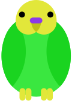

# Budgie website
This repository is the website source code for the Budgie.js HTML5 game engine. Brought to you by LugoCorp.

## Development
To set up a server for the site, run this:

```
php -S localhost:2019
```

Then open `http://localhost:2019` in your browser. If `localhost` doesn't work for whatever reason, replace with `127.0.0.1`.

## Todo
- [ ] Add CodeMirror library to the site
  - [ ] Replace every code snippet in the library page with a CodeMirror div
  - [ ] Replace every code snippet in the examples page with a CodeMirror div
- [ ] Learn how to use [Cairn](https://alugocp.github.io/cairn/) to build the site
